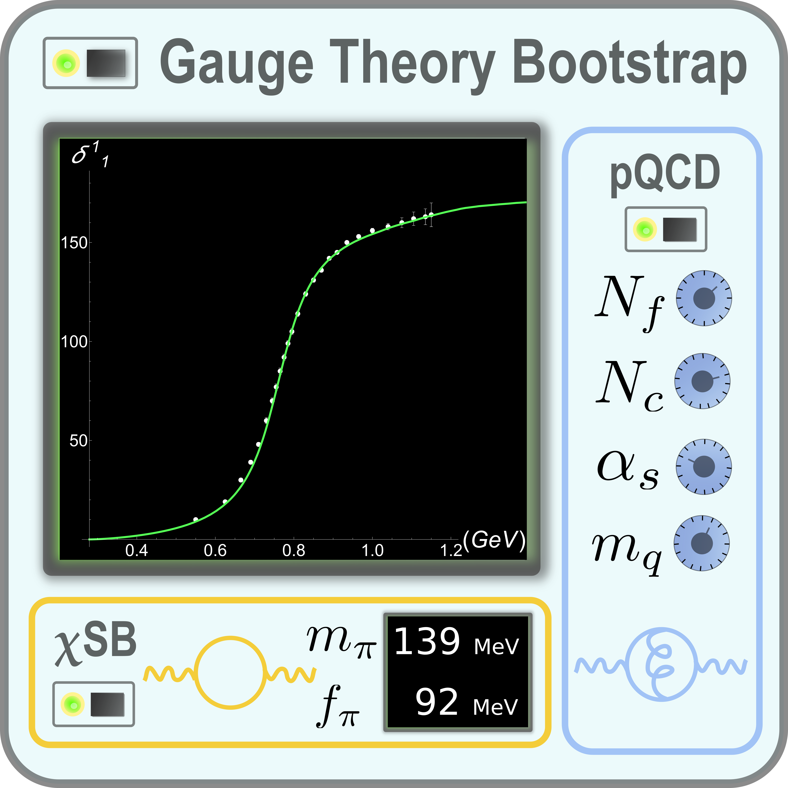

# Gauge Theory Bootstrap (QCD)

This repository contains the **Gauge Theory Bootstrap** code applied to **QCD**.  
<p align="center">
  
</p>
The workflow combines **Mathematica** and **MATLAB**: Mathematica generates numerical kernels, MATLAB runs the optimization, and Mathematica plots the results.

---

## Quickstart

Reproduce the basic GTB_QCD pipeline in three steps:

1. **Generate matrices (Mathematica)**  
   - Open `theories/qcd/src/mathematica/gtb_qcd_01_generate_matrices.nb` in Mathematica.  
   - Evaluate the notebook.  
   - Output: matrices and kernels are written into  
     `theories/qcd/data/matrices/`.

2. **Run optimization (MATLAB)**  
   - Open MATLAB in the repo root.  
   - Run:  
     ```matlab
     run('theories/qcd/src/matlab/gtb_qcd_02_optimize.m')
     ```  
   - Output: optimization results are saved into  
     `theories/qcd/data/results/` (in `.json` formats).

3. **Plot results (Mathematica)**  
   - Open `theories/qcd/src/mathematica/gtb_qcd_03_plot_results.nb`.  
   - Evaluate the notebook.  
   - Output: figures are exported into  
     `theories/qcd/data/figures/`.

**Pipeline:**  
👉 Mathematica (`gtb_qcd_01_generate_matrices.nb`) → MATLAB (`gtb_qcd_02_optimize.m`) → Mathematica (`gtb_qcd_03_plot_results.nb`)

---

## Repository layout

```text
gauge-theory-bootstrap/
├── README.md               ← this file
└── theories/
    └── qcd/
        ├── src/            ← source code
        │   ├── mathematica/
        │   │   ├── gtb_qcd_01_generate_matrices.nb
        │   │   ├── gtb_qcd_03_plot_results.nb
        │   └── matlab/
        │       └── gtb_qcd_02_optimize.m
        ├── data/           ← generated artifacts (not versioned)
        │   ├── matrices/   ← numerical kernels from step 01
        │   ├── results/    ← optimization results from step 02
        │   └── figures/    ← plots from step 03
        └── papers/          ← snapshots associated with arXiv papers
            ├── arxiv-2403.10772/
            └── arxiv-2505.19332/

```

- `src/` – notebooks and scripts for each step.  
- `data/` – empty by default; filled when you run the pipeline.  
- `papers/` – frozen snapshots corresponding to published arXiv papers.

---

## Requirements

- **Mathematica** ≥ 12.0  
- **MATLAB** ≥ R2019b  
  - [CVX](http://cvxr.com/cvx/) (convex optimization package)  
  - [MOSEK](https://www.mosek.com/) (solver backend)   

---

## Paper snapshots

This program has been used in several papers, with more developments ongoing. To ensure reproducibility, we provide snapshots of the code used for each one:

- **Bootstrapping gauge theories**  
  - [arXiv:2309.12402](https://arxiv.org/abs/2309.12402)  
  - Original proposal of the Gauge Theory Bootstrap.  
  - No public code was provided at the time.

- **Gauge Theory Bootstrap: Pion amplitudes and low energy parameters**  
  - [arXiv:2403.10772](https://arxiv.org/abs/2403.10772)  
  - First released version of the program.  
  - Snapshot archived under:  
    `theories/qcd/paper/arxiv-2403.10772/`.

- **The Gauge Theory Bootstrap: Predicting pion dynamics from QCD**  
  - [arXiv:2505.19332](https://arxiv.org/abs/2505.19332)  
  - Current version of the program (main branch). 
  - Snapshot archived under:  
    `theories/qcd/paper/arxiv-2505.19332/`.
